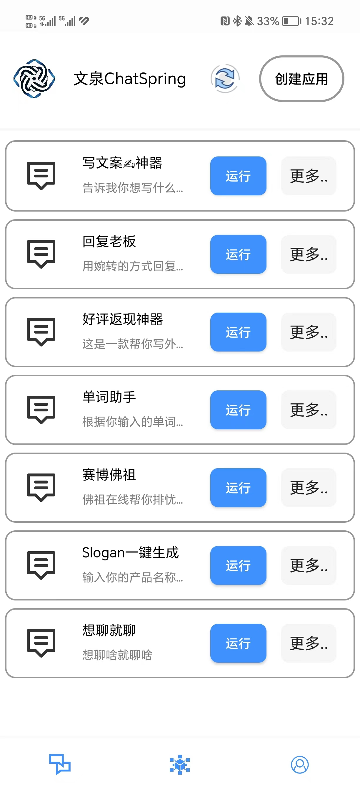
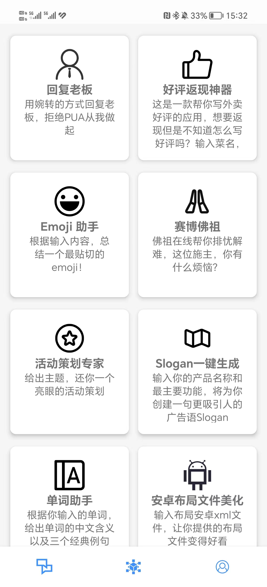

# 文泉 ChatSpring
[English](README.md) | [简体中文](README_zh.md)

A GPT-based AI toolkit app! 🚀

Wenquan ChatSpring is dedicated to **helping you easily create your own AI applications**, with preset prompts for a one-click experience, turning creative ideas into reality seamlessly. ✨

Simply enter OpenAI's **API KEY** to enjoy the intelligent convenience brought by Wenquan ChatSpring. We continue to offer you a higher quality, more efficient experience without extra costs. 🎉

In our diverse **Application Workshop**, you can explore various applications shared by users, sparking your creative inspiration. 💡

Wenquan ChatSpring — making your life, study, and work more convenient and efficient, embarking on a new journey of wisdom! 🌟

## App Interface

  
<strong>App Center</strong>

  
  
<strong>Application Workshop</strong>

  

## Contact Us
If you have any questions or suggestions, feel free to contact us through the following methods:
- Submit an Issue or PR on our GitHub Repo
- WeChat contact: Hustle-lesdimbeyond
- Email us at panggoat5@gmail.com

## Contribute Code
We welcome everyone to submit PRs!

## Contributors

[Contributors](https://github.com/Goat11/ChatSpring/graphs/contributors)

## License

[Apache License 2.0](https://www.apache.org/licenses/LICENSE-2.0)
