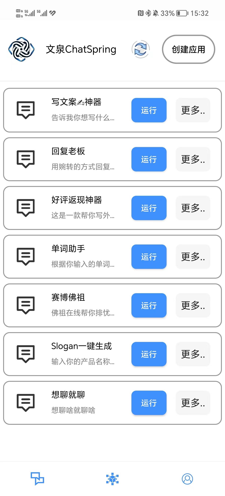
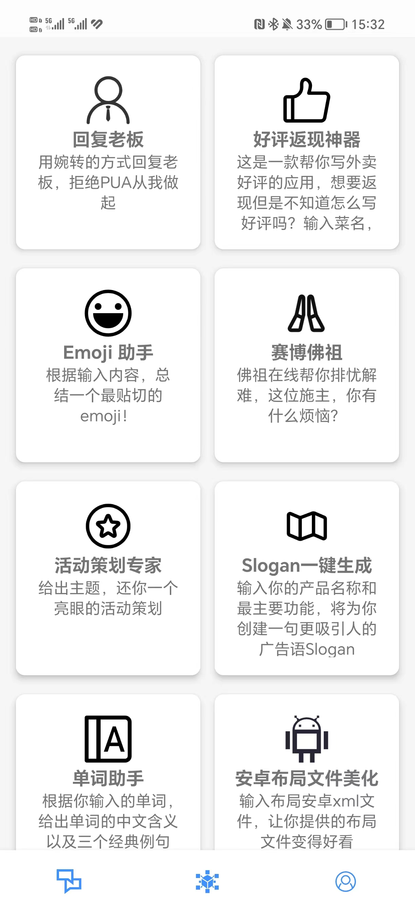

  
  <h1 align="center">文泉 ChatSpring 💬🌟 </h1>

[English](README.md) | [简体中文](README_zh.md)

一款基于GPT的AI工具箱APP！🚀

文泉Chatspring致力于**协助您轻松打造专属的AI应用**，通过预制的prompt实现一键式体验，将创意源源不断地转化为现实。✨

只需输入OpenAI的**API KEY**，便可尽享文泉Chatspring带来的智能便利。我们持续为您提供更优质、更高效的体验，让您免去额外费用。🎉

在我们丰富多样的**应用工坊**中，您可畅游于用户分享的各类应用，激发您的创意灵感。💡

文泉ChatSpring——让您的生活、学习与工作变得更加便捷、高效，开启全新的智慧之旅！🌟

## ChatSpring 能干什么？ 🤖

### 🏭 应用中心
- **创建定制AI应用**：通过自定义prompt和描述设计专属的AI应用
- **部署前测试**：在发布应用前，使用示例输入测试您的AI应用
- **管理您的应用**：编辑、删除、分享和组织您创建的应用
- **GPT集成**：支持GPT-3.5和GPT-4模型
- **图标定制**：为您的应用个性化定制图标

### 🛠️ 创意工坊
- **发现社区应用**：浏览和探索其他用户分享的AI应用
- **导入使用**：从社区工坊导入有趣的应用并使用
- **分享创作**：将您的AI应用分享给全球社区
- **灵感中心**：从多样化的用例和创意实现中获得灵感

### ⚙️ 智能设置
- **用户认证**：安全的登录和账户管理
- **API配置**：简单的OpenAI API密钥设置和管理
- **模型选择**：根据需要选择GPT-3.5或GPT-4
- **应用信息**：版本信息和开发者详情

### 🚀 核心特性
- **一键体验**：预配置的prompt实现即时AI交互
- **无额外费用**：使用您自己的OpenAI API密钥，无需额外收费
- **跨平台分享**：社区驱动的应用生态系统
- **实时测试**：创建和测试应用时获得即时反馈
- **直观界面**：对初学者和专家都友好的用户设计

## 应用界面

  
<strong>应用中心</strong>

  
  
<strong>应用工坊</strong>

  

## 联系我们
如果您有任何问题、建议，欢迎通过以下方式联系我们：
- 在我们的 GitHub Repo 上提交 Issue 或 PR
- 微信联系：Hustle-lesdimbeyond
- 发送邮件至 panggoat5@gmail.com

## 贡献代码
我们欢迎所有人提交 PR！

## 贡献者

[Contributors](https://github.com/Goat11/ChatSpring/graphs/contributors)

## License

[Apache License 2.0](https://www.apache.org/licenses/LICENSE-2.0)
